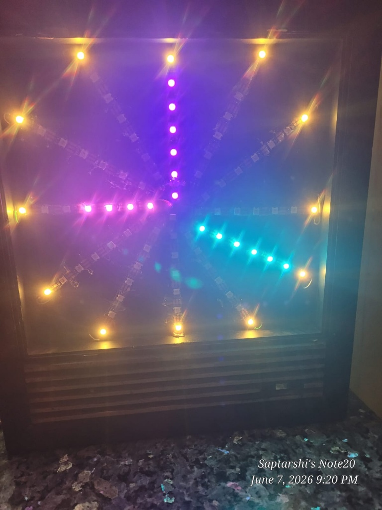
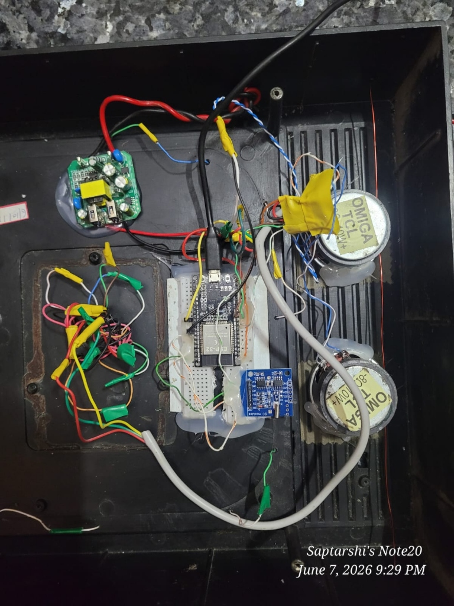
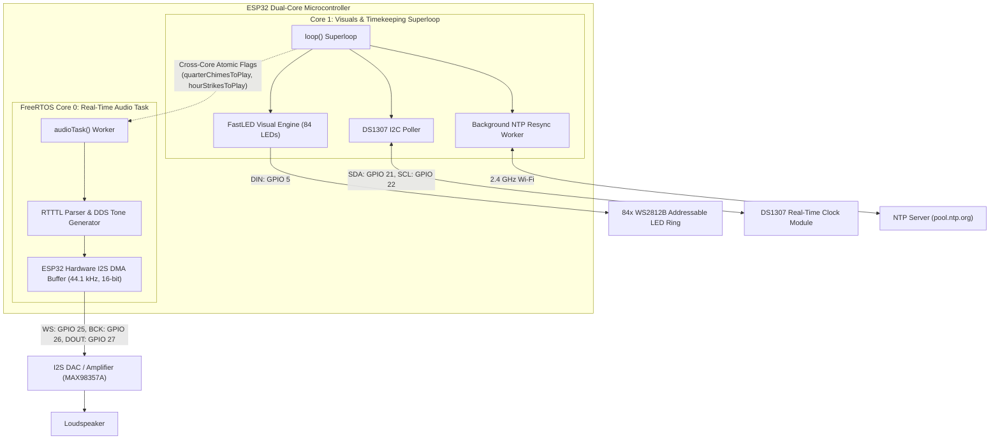

# Dual-Core ESP32 Smart Grandfather Clock

A dual-core ESP32 embedded horological system featuring real-time I2S digital audio synthesis, Westminster chimes, FreeRTOS dual-core task distribution, an 84-addressable-LED clock face, and dual-layer NTP / hardware RTC synchronization.


---

## Overview

The ESP32 Smart Grandfather Clock reimagines classic grandfather clock timekeeping using modern microcontroller architecture. Traditional mechanical chimes and escapements are implemented as digital real-time tasks: quarter-hour Westminster chimes and hour gong strikes are synthesized over I2S and isolated on FreeRTOS Core 0 to prevent audio underrun. An 84-pixel WS2812B LED ring on Core 1 displays dial indices, rotating hands, and time-of-day color transitions without visual stutter. Time accuracy is maintained through redundant timekeeping: Network Time Protocol (NTP) synchronization over 2.4 GHz Wi-Fi automatically sets the system time, with automatic fallback to a battery-backed DS1307 real-time clock during network outages.

<p align="center">
  
  <br>
  <em><strong>Figure 1:</strong> Illuminated radial horological clock display in operation, showcasing 12 outer warm-amber hour indices and color-differentiated radial arms for hour, minute, and second tracking.</em>
</p>

---

## Features

- **Asynchronous Dual-Core Processing:** Audio generation runs on FreeRTOS Core 0 (`audioTask`), ensuring zero stutter or DMA buffer starvation while FastLED rendering and sensor polling execute independently on Core 1.
- **I2S Digital Audio Output:** High-fidelity 44.1 kHz, 16-bit audio streaming via standard I2S protocol (Word Select, Bit Clock, Data Out) interfaced to an external DAC or amplifier.
- **Westminster Chimes & Hour Gongs:** Programmatic audio synthesis using decoded RTTTL melody definitions for quarter-hour chimes (15, 30, 45 min) and deep acoustic gong counts at top of the hour.
- **84-LED Circular Horological Display:** WS2812B addressable LED ring rendered via FastLED, featuring 12 hour dial markers, hour/minute/second hands, and daytime-aware ambient color shifting.
- **Dual-Layer Timekeeping Architecture:** Automatic network synchronization via NTP (`pool.ntp.org`, IST UTC+5:30) with non-blocking background resynchronization and hardware DS1307 I2C RTC backup.
- **Scheduled Quiet Hours:** Software mute window logic suppresses chime output during configurable nighttime hours to avoid disturbance.

---

## Hardware Architecture & Pin Mapping

<p align="center">
  
  <br>
  <em><strong>Figure 2:</strong> Internal chassis cavity featuring ESP32 DevKit, battery-backed DS3231/DS1307 RTC, regulated AC-DC step-down power converter, and dual 8Ω 10W acoustic chime speakers for Westminster melodies and hour strikes.</em>
</p>

### Component Requirements
- **Microcontroller:** ESP32 DevKit V1 (Xtensa dual-core 32-bit LX6 @ 240 MHz)
- **Audio Output:** I2S DAC Module (e.g., MAX98357A, PCM5102A, or I2S amplifier) + 4-8 Ohm speaker
- **LED Display:** WS2812B addressable RGB LED ring (84 pixels total)
- **Real-Time Clock:** DS1307 RTC module with CR2032 coin-cell backup battery
- **Power Supply:** 5V DC regulated power supply (minimum 2.0A recommended to supply LED peaks and audio amplifier)

### Pin Mapping Table

| Peripheral | Signal / Function | ESP32 GPIO | Electrical Notes |
|---|---|---|---|
| **I2S Audio DAC** | Word Select (WS / LRCK) | **GPIO 25** | DAC left/right channel framing clock |
| **I2S Audio DAC** | Bit Clock (BCK / BCLK) | **GPIO 26** | Audio serial bit clock |
| **I2S Audio DAC** | Serial Data (DOUT / DIN) | **GPIO 27** | 16-bit digital PCM audio stream |
| **WS2812B LED Ring** | Data In (DIN) | **GPIO 5** | 800 kHz NRZ data stream (FastLED) |
| **DS1307 RTC** | I2C Serial Data (SDA) | **GPIO 21** | Standard ESP32 hardware I2C data |
| **DS1307 RTC** | I2C Serial Clock (SCL) | **GPIO 22** | Standard ESP32 hardware I2C clock |
| **System Power** | 5V / VBUS | 5V Rail | Supplies WS2812B and audio amp |
| **System Ground** | Common Ground | GND | Shared return for all modules |

---

## Block Diagram



---

## Software & Tools

- **Programming Language:** C++ (Arduino Framework)
- **Development Environment:** PlatformIO Core / PlatformIO IDE for VS Code
- **Target Platform:** `espressif32` (`board = esp32dev`, 115200 baud)
- **Partition Scheme:** `huge_app.csv` (allocated for large flash buffers and sound font assets)
- **Core Libraries:**
  - `FastLED` (^3.10.3) — High-performance WS2812B LED timing and palette math
  - `RTClib` (^2.1.4) — I2C DS1307 communication
  - `ESP32-audioI2S` (^2.3.0) & `arduino-audio-tools` — I2S audio drivers and streaming
  - `driver/i2s.h` — ESP-IDF native hardware I2S peripheral driver

---

## Project Structure

```
ESP32-Smart-Grandfather-Clock/
├── .vscode/
│   └── extensions.json       # Recommended IDE extensions
├── include/
│   ├── README                # Header directory guidance
│   ├── soundfont.h           # Pre-compiled SoundFont binary array asset
│   └── tsf.h                 # TinySoundFont synthesizer library header
├── lib/
│   └── README                # Private project libraries directory
├── src/
│   └── main.cpp              # Primary application firmware and FreeRTOS tasks
├── test/
│   └── README                # Hardware unit tests directory
├── platformio.ini            # PlatformIO project configuration and dependencies
└── README.md                 # Complete engineering documentation
```

---

## Setup and Usage

### Prerequisites
1. Install [PlatformIO Core](https://platformio.org/install/cli) or the PlatformIO IDE extension in Visual Studio Code.
2. Connect your ESP32 DevKit board via a high-quality micro-USB data cable.

### Build and Upload
```bash
# Clone the repository
git clone https://github.com/saptarshidas578/ESP32-Smart-Grandfather-Clock.git
cd ESP32-Smart-Grandfather-Clock

# Compile firmware
pio run -e esp32dev

# Upload to ESP32
pio run -e esp32dev -t upload

# Open Serial Monitor (115200 baud)
pio run -e esp32dev -t monitor -b 115200
```

### Wi-Fi Configuration
*Note: Before first deployment, configure your 2.4 GHz Wi-Fi credentials in `src/main.cpp`:*
```cpp
const char *ssid = "YOUR_WIFI_SSID";
const char *password = "YOUR_WIFI_PASSWORD";
```
*If Wi-Fi is unavailable or credentials are unset, the clock boots directly into offline mode using the DS1307 RTC.*

---

## Future Work

- [ ] Web-based configuration portal (ESP32 Captive Portal / AsyncWebServer) to set Wi-Fi credentials, chime melodies, and quiet hours without re-flashing.
- [ ] Integration of ambient light sensor (LDR or BH1750) to dynamically adjust LED brightness to room lighting.
- [ ] Rotary encoder or capacitive touch interface for tactile manual chime volume adjustment.

---

## Author & Contact

- **Author:** [saptarshi2007 (saptarshidas578)](https://github.com/saptarshidas578)
- **Institution:** B.Tech Electrical & Computer Science Engineering, VIT Vellore
- **LinkedIn:** TODO(author): add link

---

## License

This project is licensed under the [MIT License](LICENSE).
